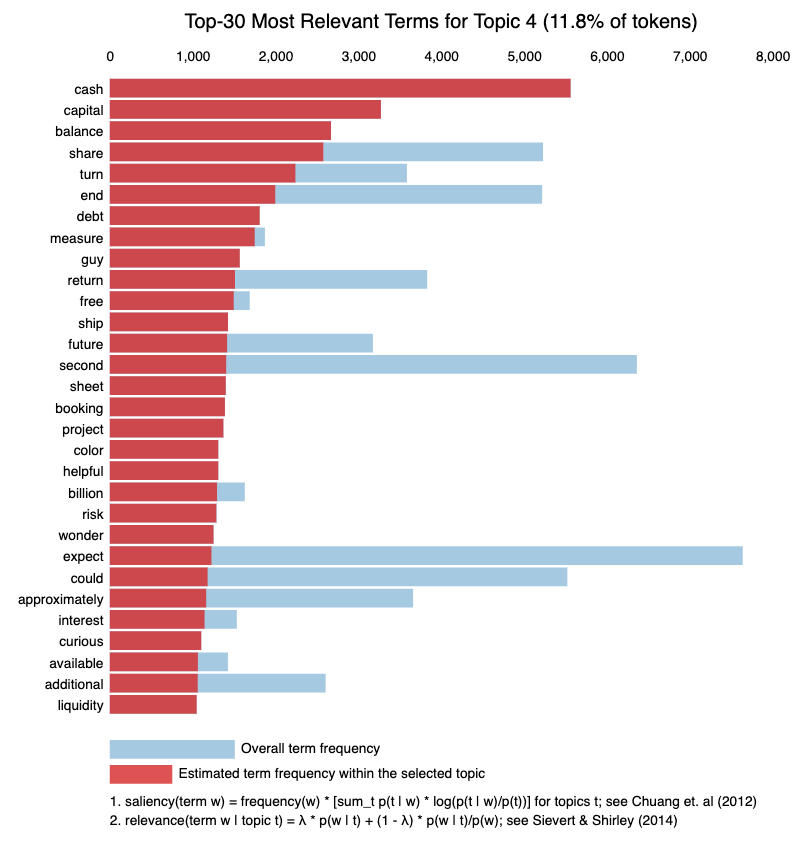

# Text Mining on Earnings Calls during a Pandemic as a Means to Predict End-Of-The-Month Stock Performances

### Hotels, Restaurants, and Leisure and Transportation
#### Earning calls of publicly traded companies based in North America in the consumer and industrial sector

Investors, analysts, and financial institutions have an arsenal of mathematical, economic, and analytical tools that can be used to extract information from public companies in order to make valuable and tradeable decisions. One of the richest and ever-growing resources available is unstructured text and data that has and will continue to grow exponentially. This project uses earnings calls to identify common themes across companies within the retail and transportation sectors. These themes then help us understand how companies behave and talk during global crises and how their speech differs depending on their performance at a given time. By leveraging topic modeling and sentiment analysis, earnings calls and end-of-the-month stock performance data are paired so as to gain insight into sector-wide common topics during a crisis (in this case, the COVID-19 pandemic). The results of this use case can be used as a source of signals to trade specific market sectors and identify market weaknesses and strengths based on topics gathered from earnings calls. 

## Data Description

The data mined in this project consists of financial earnings calls of publicly traded companies based in North America. Data from the consumer sector was sourced from the hotels, restaurants, and leisure segment. Data from the industrial sector was sourced from transportation. Publicly-traded companies typically hold an earnings call every quarter during which quarterly performance is shared, forward-looking statements can be made (which are predictive in nature), and explanations for quarterly achievement or lack thereof are shared. A variety of parties may participate in earnings calls, including company executives, C-Suite level executives, investors, and shareholders.

## Project Objectives

First, this project aims to analyze the type of speech used during earnings calls in a global crisis in order to identify cross-sectional topics in industries that are directly impacted by said crisis (in this case, the COVID-19 pandemic). In doing so, this project then aims to identify whether companies within the same industry share the same type of speech when sharing obstacles and struggles when facing a crisis. By pairing earnings calls with stock price movement at the end of a given month during the crisis in 2020, a positive or negative direction of the stock price can be gleaned. For the purpose of this project, the positive or negative direction of a stock price is used as an indicator of sentiment (positive or negative connotation) in the earnings call speech. By using these indicators, we can use sentiment analysis to predict the sentiment of the earnings call speech, which can then, in turn, be used to predict the end of the month stock price direction. In short, the objective of this project is to learn common topics within an industry during a global crisis and to analyze earnings call sentiment analysis in order to predict end-of-the-month stock price performance. 

## References

* Nielson, J. (2020, October 5). Sentiment analysis of U.S. broadcast earnings call transcripts. Accelerating Progress. Retrieved December 18, 2021, from https://www.spglobal.com/marketintelligence/en/news-insights/blog/sentiment-analysis-of-us-broadcast-earnings-call-transcripts

* Zhao, F. (2017, September 14). Natural language processing, part I: Primer. Natural Language Processing, Part I Primer | S&P Global Market Intelligence. Retrieved December 18, 2021, from https://www.spglobal.com/marketintelligence/en/news-insights/research/natural-language-processing-part-i-primer

* Zhao, F. (2018, September 12). Natural language processing – part II: Stock selection. S&P Global Market Intelligence. Retrieved December 18, 2021, from https://www.spglobal.com/marketintelligence/en/news-insights/research/natural-language-processing-part-ii-stock-selection

* Zhao, F. (2020, January 31). Natural language processing – part III: Feature engineering. S&P Global Market Intelligence. Retrieved December 18, 2021, from https://www.spglobal.com/marketintelligence/en/news-insights/research/natural-language-processing-part-iii-feature-engineering

